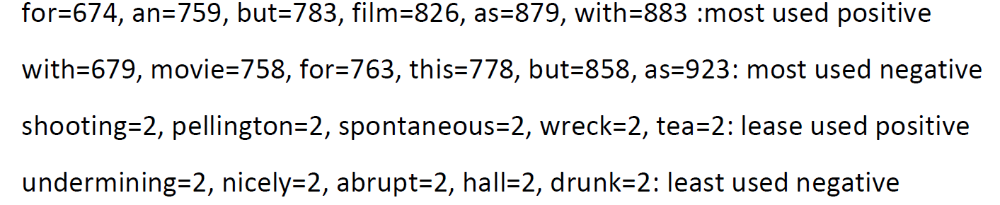

We'll examine the effect of deleting repetitive and low-repetition words in the text in the accuracy obtained with a few examples;

I see a film as you as an amazing.
Portion: 30.315406
don't filter this.

I see a movie with you for this
Portion: 2.546671
Filter this

The first sentence is about the most repetitive and least repetitive positive words. The second sentence is for negative ones.

As you see, using the low-repetition words with positive ones causes the negative output and vice versa.

Impact of Lambda and Epsilon on the accuracy;  
Decreasing the Lambda and Epsilon causes the augment of the accuracy to recognize the positive or negative sentences.

The Best accuracy achieved and analyze the effect of parameters on it;
As we mentioned prior, Decreasing the Lambda and Epsilon causes the augment of the accuracy to recognize the positive or negative sentences.